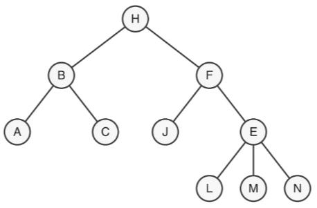
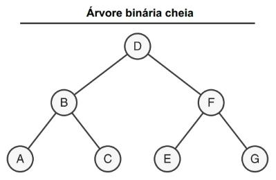
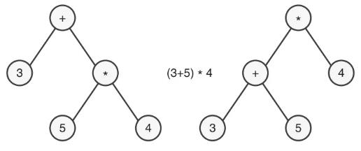
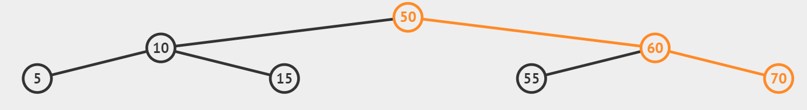
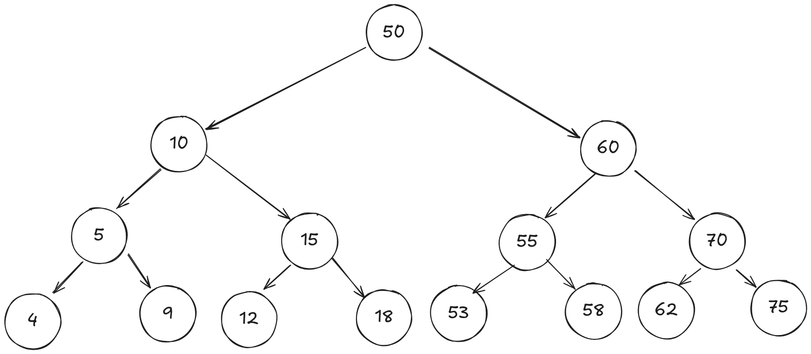

# Lista 06: Árvore Binária

## Questão 01

- **a) Qual o número de nós?**

  10 nós

- **b) Qual é a altura?**

  3

- **c) Qual é o nó raiz?**

  H

- **d) Quais os nós folhas?**

  A, C, J, L, M e N

- **e) Quais os nós no nível 2?**

  A, C, J e E

- **f) Quais os nós antepassados de E?**

  F e H

- **g) Quais os nós descendentes de F?**

  J, E, L, M e N

## Questão 02

- **a) Qual seria a ordem de impressão caso fosse aplicado o algoritmo de pré-ordem?**

  D, B, A, C, F, E, G

- **b) Qual seria a ordem de impressão caso fosse aplicado o algoritmo de pós-ordem?**

  A, C, B, E, G, F, D

- **c) Qual seria a ordem de impressão caso fosse aplicado o algoritmo de in-ordem?**

  A, B, C, D, E, F, G

## Questão 03

- **Pré-Ordem:** + 3 \* 5 4
- **In-Ordem:** 3 + 5 \* 4
- **Pós-Ordem:** 3 5 4 \* +

## Questão 04

- **a) Quantos valores são necessários para manter a árvore balanceada?**

  8 nós adicionais (assumindo que a pergunta se refere a adições à arvore)

- **b) Quais os valores para inserir no nó 15 a sua direita e a sua
  esquerda?**

  Esquerda: 10 < x < 15. Direita: 15 < x < 50

- **c) Quais os valores para inserir no nó 55 a sua direita e a sua
  esquerda?**

  Esquerda: 50 < x < 55. Direita: 55 < x < 60

- **d) Como ficaria o novo desenho da estrutura de árvore binário com a
  inserção dos valores: 4 – 9 – 12 – 18 – 53 – 58 – 62 – 75?**

  

- **e) Quem será o pai caso seja inserido o valor 57?**

  Nó 55

- **f) Quem será o pai caso seja inserido o valor 20?**

  Nó 15
