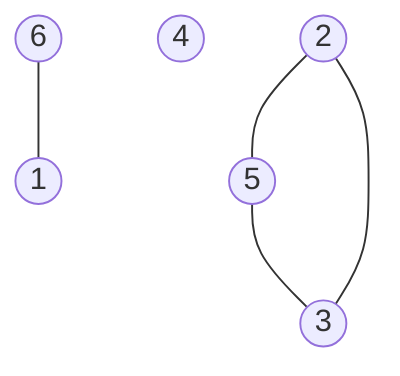
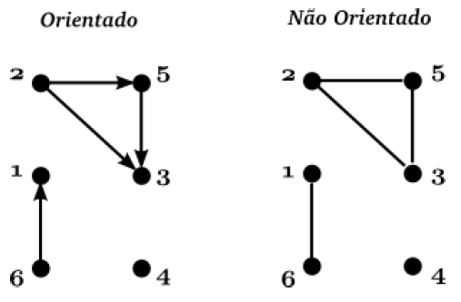
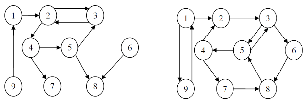
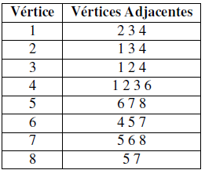
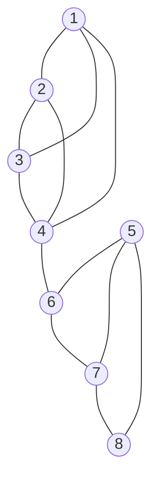
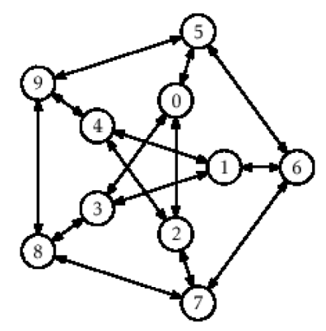
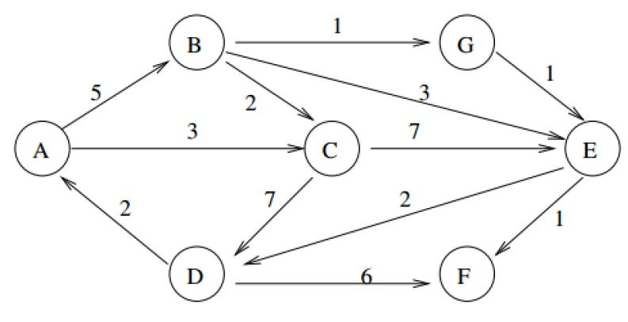
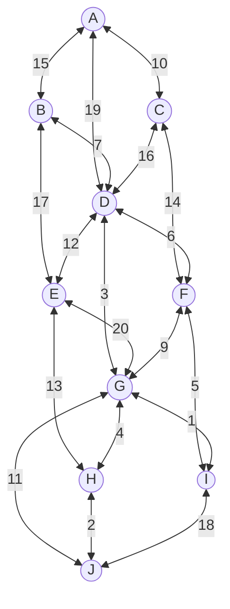

# Lista 09: Grafos

## Questão 1

Desenhe o grafo não direcionado $G(V,E)$, onde $V = {1, 2, 3, 4, 5, 6}$ e $E = {(2, 5), (6, 1), (5, 3), (2, 3)}$.



## Questão 2

Diante dos grafos ilustrados abaixo responda ao que se pede:



- **a)** Quais os vértices adjacentes do vértice 5 do Grafo `a`?

  Vértices 2 e 3.

- **b)** Quais os vértices adjacentes do vértice 5 do Grafo `b`?

  Vértices 2 e 3.

- **c)** Quais o grau do vértice 2 do Grafo `a`?

  O vértice 2 possui grau de entrada 0 e grau de saída 2. O grau resultante é 2.

- **d)** Quais o grau do vértice 3 do Grafo `a`?

  O vértice 3 possui grau de entrada 2 e grau de saída 0. O grau resultante é 2.

## Questão 3

Dado o grafo $G=(V,E)$, sendo:

$V = {M,N,O,P,Q,R,S}$
$E = {(M, S), (N,O), (P,R), (N, S), (O,M), (N,Q), (P, P), (S,M), (O,N), (N,R), (P,M)}$

Responda ao que se pede:

- **a)** Desenhar o grafo;

  ```mermaid
  graph TD
      M((M))
      N((N))
      O((O))
      P((P))
      Q((Q))
      R((R))
      S((S))

      M --> S
      N --> O
      P --> R
      N --> S
      O --> M
      N --> Q
      P --> P
      S --> M
      O --> N
      N --> R
      P --> M
  ```

- **b)** Qual o grau dos vértices N e R?
  - **`N`:** grau de entrada 1 (vértice `O`), grau de saída 4 (vértices `O`,
    `S`, `Q`, `R`). Total: 5.
  - **`R`:** grau de entrada 2 (vértices `P` e `N`), grau de saída 0. Total: 2.

- **c)** Quantas arestas tem esse grafo?

  11 arestas.

- **d)** Qual os vértices adjacentes dos vértices P e Q?

  Os vértices adjacentes do vértice P são os vértices `M`, `R` e o próprio `P`,
  enquanto o `Q` possui apenas o `N` adjacente.

## Questão 04

Desenhar os grafos de acordo com os dados abaixo:

- **a)** $V = {1,2,3,4}$, $E = {(1,2),(1,3),(1,4),(2,3),(2,4),(3,4)}$

  ```mermaid
  graph TD
    A((1))
    B((2))
    C((3))
    D((4))

    A --- B
    A --- C
    A --- D
    B --- C
    B --- D
    C --- D
  ```

- **b)** $V = {1,2,3,4,5,6,7}$, $E = {(1,2),(1,3),(2,4),(2,5).(3,6),(3,7)}$

  ```mermaid
  graph TD
    A((1))
    B((2))
    C((3))
    D((4))
    E((5))
    F((6))
    G((7))

    A --- B
    A --- C
    B --- D
    B --- E
    C --- F
    C --- G
  ```

## Questão 05

Dado os grafos abaixo, responda as questões abaixo:



- **a)** Qual o grau do vértice 4 no grafo (b)?

  Grau de entrada 1, grau de saída 2. Total: 3

- **b)** Qual o grau do vértice 9 no grafo (b)?

  Grau de entrada 1, grau de saída 1. Total: 2

- **c)** Qual o grau do vértice 6 no grafo (a)?

  Grau de entrada 0, grau de saída 1. Total: 1

- **d)** Qual o grau do vértice 9 no grafo (a)?

  Grau de entrada 0, grau de saída 1. Total: 1

- **e)** Quais os vértices adjacentes do vértice 8 no gráfico (b)?

  Vértices 5, 6 e 7.

- **f)** Quais os vértices adjacentes do vértice 5 no gráfico (a)?

  Vértices 3, 4 e 8. Os vértices 8 e 3 são conectados por duas arestas.

- **g)** Qual o comprimento do caminho entre os vértices 1 e 4 do gráfico (b)?

  O menor caminho do vértice 1 ao 4 possui tamanho 4 (1 -> 2 -> 3 -> 5 -> 4).

- **h)** Qual o comprimento do caminho entre os vértices 1 e 8 do gráfico (a)?

  O menor caminho do vértice 1 ao 8 possui tamanho 4 (1 -> 2 -> 4 -> 5 -> 8).

## Questão 06

Seja um grafo G cujos vértices são os inteiros de 1 a 8 e os vértices
adjacentes a cada vértice são dados pela tabela abaixo, desenhar o grafo G.





## Questão 07

Dado o grafo abaixo, responda ao que se pede:



- **a)** Represente todos os caminhos possíveis entre os vértices 5 e 1:

  5 -> 0 -> 2 -> 4 -> 1
  5 -> 0 -> 2 -> 4 -> 9 -> 8 -> 3 -> 1
  5 -> 0 -> 2 -> 4 -> 9 -> 8 -> 7 -> 6 -> 1
  5 -> 0 -> 2 -> 7 -> 6 -> 1
  5 -> 0 -> 2 -> 7 -> 8 -> 3 -> 1
  5 -> 0 -> 2 -> 7 -> 8 -> 9 -> 4 -> 1
  5 -> 0 -> 3 -> 1
  5 -> 0 -> 3 -> 8 -> 7 -> 2 -> 4 -> 1
  5 -> 0 -> 3 -> 8 -> 7 -> 6 -> 1
  5 -> 0 -> 3 -> 8 -> 9 -> 4 -> 1
  5 -> 0 -> 3 -> 8 -> 9 -> 4 -> 2 -> 7 -> 6 -> 1
  5 -> 6 -> 1
  5 -> 6 -> 7 -> 2 -> 0 -> 3 -> 1
  5 -> 6 -> 7 -> 2 -> 0 -> 3 -> 8 -> 9 -> 4 -> 1
  5 -> 6 -> 7 -> 2 -> 4 -> 1
  5 -> 6 -> 7 -> 2 -> 4 -> 9 -> 8 -> 3 -> 1
  5 -> 6 -> 7 -> 8 -> 3 -> 0 -> 2 -> 4 -> 1
  5 -> 6 -> 7 -> 8 -> 3 -> 1
  5 -> 6 -> 7 -> 8 -> 9 -> 4 -> 1
  5 -> 6 -> 7 -> 8 -> 9 -> 4 -> 2 -> 0 -> 3 -> 1
  5 -> 9 -> 4 -> 1
  5 -> 9 -> 4 -> 2 -> 0 -> 3 -> 1
  5 -> 9 -> 4 -> 2 -> 0 -> 3 -> 8 -> 7 -> 6 -> 1
  5 -> 9 -> 4 -> 2 -> 7 -> 6 -> 1
  5 -> 9 -> 4 -> 2 -> 7 -> 8 -> 3 -> 1
  5 -> 9 -> 8 -> 3 -> 0 -> 2 -> 4 -> 1
  5 -> 9 -> 8 -> 3 -> 0 -> 2 -> 7 -> 6 -> 1
  5 -> 9 -> 8 -> 3 -> 1
  5 -> 9 -> 8 -> 7 -> 2 -> 0 -> 3 -> 1
  5 -> 9 -> 8 -> 7 -> 2 -> 4 -> 1
  5 -> 9 -> 8 -> 7 -> 6 -> 1

- **b)** Represente todos os caminhos possíveis entre os vértices 9 e 3:

  9 -> 4 -> 1 -> 3
  9 -> 4 -> 1 -> 6 -> 5 -> 0 -> 2 -> 7 -> 8 -> 3
  9 -> 4 -> 1 -> 6 -> 5 -> 0 -> 3
  9 -> 4 -> 1 -> 6 -> 7 -> 2 -> 0 -> 3
  9 -> 4 -> 1 -> 6 -> 7 -> 8 -> 3
  9 -> 4 -> 2 -> 0 -> 3
  9 -> 4 -> 2 -> 0 -> 5 -> 6 -> 1 -> 3
  9 -> 4 -> 2 -> 0 -> 5 -> 6 -> 7 -> 8 -> 3
  9 -> 4 -> 2 -> 7 -> 6 -> 1 -> 3
  9 -> 4 -> 2 -> 7 -> 6 -> 5 -> 0 -> 3
  9 -> 4 -> 2 -> 7 -> 8 -> 3
  9 -> 5 -> 0 -> 2 -> 4 -> 1 -> 3
  9 -> 5 -> 0 -> 2 -> 4 -> 1 -> 6 -> 7 -> 8 -> 3
  9 -> 5 -> 0 -> 2 -> 7 -> 6 -> 1 -> 3
  9 -> 5 -> 0 -> 2 -> 7 -> 8 -> 3
  9 -> 5 -> 0 -> 3
  9 -> 5 -> 6 -> 1 -> 3
  9 -> 5 -> 6 -> 1 -> 4 -> 2 -> 0 -> 3
  9 -> 5 -> 6 -> 1 -> 4 -> 2 -> 7 -> 8 -> 3
  9 -> 5 -> 6 -> 7 -> 2 -> 0 -> 3
  9 -> 5 -> 6 -> 7 -> 2 -> 4 -> 1 -> 3
  9 -> 5 -> 6 -> 7 -> 8 -> 3
  9 -> 8 -> 3
  9 -> 8 -> 7 -> 2 -> 0 -> 3
  9 -> 8 -> 7 -> 2 -> 0 -> 5 -> 6 -> 1 -> 3
  9 -> 8 -> 7 -> 2 -> 4 -> 1 -> 3
  9 -> 8 -> 7 -> 2 -> 4 -> 1 -> 6 -> 5 -> 0 -> 3
  9 -> 8 -> 7 -> 6 -> 1 -> 3
  9 -> 8 -> 7 -> 6 -> 1 -> 4 -> 2 -> 0 -> 3
  9 -> 8 -> 7 -> 6 -> 5 -> 0 -> 2 -> 4 -> 1 -> 3
  9 -> 8 -> 7 -> 6 -> 5 -> 0 -> 3

Para resolução da questão 07 utilizei o algorítimo de Depth First Search (DFS) para busca exaustiva de todos os caminhos:

```python
from dataclasses import dataclass
from typing import NamedTuple


@dataclass(frozen=True)
class Vertice:
    valor: int


class Aresta(NamedTuple):
    de: Vertice
    para: Vertice


class GrafoDirecionado:
    def __init__(self) -> None:
        self._arestas: set[Aresta] = set()
        self._lista_adjacencia: dict[Vertice, set[Vertice]] = {}

    def adicionar_vertice(self, vertice: Vertice) -> None:
        if vertice in self._lista_adjacencia:
            return

        self._lista_adjacencia[vertice] = set()

    def adicionar_aresta(self, aresta: Aresta) -> None:
        self.adicionar_vertice(aresta.de)
        self.adicionar_vertice(aresta.para)

        self._lista_adjacencia[aresta.de].add(aresta.para)
        self._arestas.add(aresta)

    def listar_adjacentes(self, vertice: Vertice) -> set[Vertice]:
        if vertice not in self._lista_adjacencia:
            raise ValueError("Vértice não está no Grafo")

        return self._lista_adjacencia[vertice].copy()


def buscar_caminhos(
    grafo: GrafoDirecionado,
    de: Vertice,
    para: Vertice,
):
    caminhos: list[list[Vertice]] = []

    def dfs(vertice: Vertice, caminho: list[Vertice], visitados: set[Vertice]):
        caminho.append(vertice)
        visitados.add(vertice)

        if vertice == para:
            caminhos.append(caminho.copy())
            _ = caminho.pop()
            visitados.remove(vertice)
            return

        vizinhos_nao_visitados = filter(
            lambda v: v not in visitados,
            grafo.listar_adjacentes(vertice),
        )

        for vizinho in vizinhos_nao_visitados:
            dfs(vizinho, caminho, visitados)

        _ = caminho.pop()
        visitados.remove(vertice)

    dfs(de, [], set())
    return caminhos
```

## Questão 8

Encontre o caminho de menor custo entre os vértices A e E?



O caminho com menor custo é o: A -> B -> G -> E.

## Questão 9


